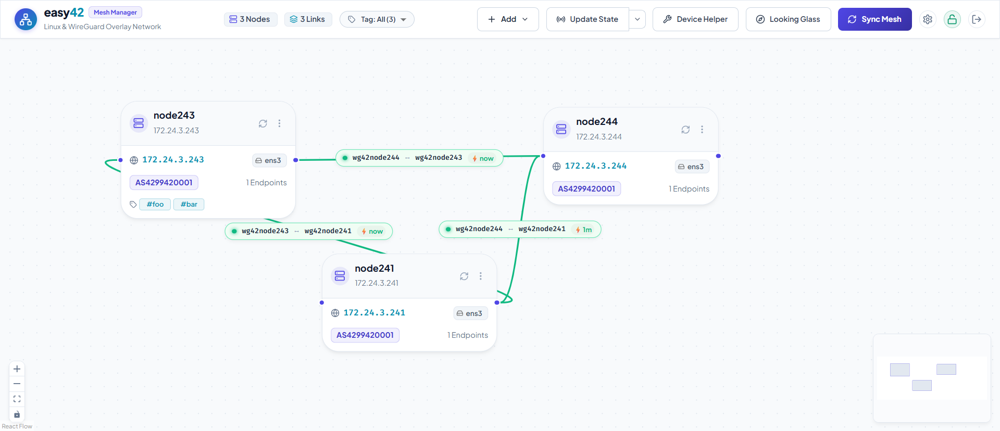

## Easy42

**Easy42** is an agent-less WireGuard overlay network orchestrator and dynamic routing automation engine. It is designed to interconnect private Linux servers, edge routers, and homelabs into high-performance, self-healing mesh networks, while providing seamless, automated BGP peering with external networks such as [DN42](https://dn42.eu/), NeoNetwork, or private Autonomous Systems. Easy42 provides an Web UI and CLI interface.



- [Easy42](#easy42)
- [Overview](#overview)
- [Key Features](#key-features)
- [Target Use Cases](#target-use-cases)
  - [1. Private Server Mesh \& Homelab Overlay](#1-private-server-mesh--homelab-overlay)
  - [2. DN42 \& Overlay Autonomous System Peering](#2-dn42--overlay-autonomous-system-peering)
  - [3. Asymmetric \& Multi-Homed Routing](#3-asymmetric--multi-homed-routing)
- [System Architecture](#system-architecture)
- [How It Works Under the Hood](#how-it-works-under-the-hood)
  - [1. Data Plane \& Link-Local IPv6 Addressing](#1-data-plane--link-local-ipv6-addressing)
    - [Deterministic Link-Local IPv6 (`fe80::/64`)](#deterministic-link-local-ipv6-fe8064)
    - [Multiprotocol BGP over IPv6 Link-Local (RFC 8950 / RFC 5549)](#multiprotocol-bgp-over-ipv6-link-local-rfc-8950--rfc-5549)
  - [2. WireGuard Configuration Breakdown](#2-wireguard-configuration-breakdown)
    - [Why These Parameters?](#why-these-parameters)
  - [3. Dynamic Routing with BIRD 2](#3-dynamic-routing-with-bird-2)
    - [BGP Confederations \& Autonomous Systems](#bgp-confederations--autonomous-systems)
    - [Route Origination \& Loopback Announcement](#route-origination--loopback-announcement)
    - [Kernel FIB Synchronization \& Preferred Source IP](#kernel-fib-synchronization--preferred-source-ip)
    - [Split Routing Tables for External Traffic](#split-routing-tables-for-external-traffic)
    - [Route Leak Protection](#route-leak-protection)
  - [4. nftables Firewall, NAT \& MSS Clamping](#4-nftables-firewall-nat--mss-clamping)
    - [Detailed Rule Explanations](#detailed-rule-explanations)
  - [5. Route Origin Authorization (ROA)](#5-route-origin-authorization-roa)
- [Network Policies](#network-policies)
  - [Link Costs \& Latency Routing](#link-costs--latency-routing)
- [Installation \& Quick Start](#installation--quick-start)
  - [Prerequisites](#prerequisites)
  - [Building from Source](#building-from-source)
  - [Starting the Service](#starting-the-service)
  - [Device Config Helper (Bootstrap Tasks)](#device-config-helper-bootstrap-tasks)
- [CLI Reference](#cli-reference)
  - [Global Flags](#global-flags)
  - [1. Server Daemon](#1-server-daemon)
  - [2. Node Management](#2-node-management)
  - [3. WireGuard Link Management](#3-wireguard-link-management)
  - [4. Status Inspection \& Connectivity Probes](#4-status-inspection--connectivity-probes)
  - [5. Topology Synchronization](#5-topology-synchronization)
- [Configuration Specification](#configuration-specification)
  - [Entrypoint Selection Algorithm](#entrypoint-selection-algorithm)
- [Security \& Encryption Architecture](#security--encryption-architecture)
- [Operational \& Troubleshooting Guide](#operational--troubleshooting-guide)
  - [Verifying WireGuard Interfaces](#verifying-wireguard-interfaces)
  - [Inspecting BIRD 2 Dynamic Routing](#inspecting-bird-2-dynamic-routing)
  - [Debugging nftables Rules](#debugging-nftables-rules)
  - [Common Gotchas \& Fixes](#common-gotchas--fixes)
- [License](#license)

## Overview

Unlike userspace overlay tools (such as Tailscale or ZeroTier) that route packets through userspace TUN adapters, Easy42 relies exclusively on the **Linux kernel WireGuard data plane**, paired with **BIRD 2** for dynamic routing (MP-BGP over IPv6 link-local) and **nftables** for stateful firewalling, MSS clamping, and policy-based SNAT.

Easy42 manages remote nodes **agent-lessly** over standard SSH/SFTP, offering both an interactive visual Web UI (topology graph editor) and a scriptable CLI.

## Key Features

- **Pure Linux Kernel Performance**: Zero userspace encapsulation overhead. Point-to-point WireGuard kernel interfaces (`wg42*`) handle all tunnel traffic at wire speed.
- **Multiprotocol BGP over IPv6 Link-Local (RFC 8950 / RFC 5549)**: Uses single-session BGP peering over deterministic IPv6 link-local addresses (`fe80::/64`) with Extended Next Hop to exchange both IPv4 and IPv6 routes, eliminating tunnel IP management (IPAM).
- **Agent-Less Node Management**: No background daemons required on target nodes. The controller connects via SSH/SFTP with public key authentication and atomic file replacement.
- **Automated BGP Confederations & iBGP/eBGP**: Supports single ASN topologies or private BGP confederations (AS 4224420000–4224429999) presenting a unified public ASN (e.g., DN42 ASN) to external peers.
- **Stateful Security & nftables Generation**: Automated compilation of `/etc/easy42.nft` featuring state tracking, path-MTU MSS clamping, cross-tunnel SNAT, and granular port ingress filtering.
- **Automated ROA Validation**: Built-in ROA caching engine that fetches remote table definitions (e.g., Burble DN42 ROA) and filters illegitimate route announcements.
- **Visual Topology & Looking Glass**: Interactive React/Vite topology canvas with drag-and-drop link creation, real-time node connectivity probes, and built-in looking glass diagnostics (`ping`, `traceroute`, `birdc show route`).
- **Cryptographic Security**: Node private keys and sensitive credentials are encrypted with XAES-256-GCM using an Argon2id-derived key and protected in volatile memory with `memguard`.

---

## Target Use Cases

### 1. Private Server Mesh & Homelab Overlay

Connect cloud VPS instances, on-premise virtualization hosts, bare-metal servers, and edge gateways into a flat, routable overlay network without port-forwarding headaches or proprietary centralized coordinators.

### 2. DN42 & Overlay Autonomous System Peering

Manage an entire DN42 Autonomous System from a single dashboard:

- Create internal iBGP/confederation meshes between your globally distributed points of presence (PoPs).
- Provision WireGuard links to external peer ASNs.
- Apply strict route-leak prevention (`reject` for default and global internet routes) and automated ROA validation.
- Route external traffic to designated egress gateways or source-NAT across transit links.

### 3. Asymmetric & Multi-Homed Routing

Use BGP path attributes (e.g., `bgp_local_pref` manipulation based on link costs) to build multi-homed topologies with deterministic failover and optimal path selection.

---

## System Architecture

```
 ┌─────────────────────────────────────────────────────────────┐
 │                      easy42 Controller                      │
 │                                                             │
 │   ┌──────────────────────┐      ┌───────────────────────┐   │
 │   │  Web UI (React/Vite) │      │      CLI (Cobra)      │   │
 │   └──────────┬───────────┘      └───────────┬───────────┘   │
 │              │                              │               │
 │              ▼                              ▼               │
 │   ┌─────────────────────────────────────────────────────┐   │
 │   │                   Engine & State                    │   │
 │   │      - Node & Link Topology Graph                   │   │
 │   │      - Network Policies & Costs                     │   │
 │   │      - ROA Fetcher & Cache Manager                  │   │
 │   │      - Encrypted State Store (config.json)          │   │
 │   └──────────────────────────┬──────────────────────────┘   │
 │                              │                              │
 │                              ▼                              │
 │   ┌─────────────────────────────────────────────────────┐   │
 │   │                   Core Compiler                     │   │
 │   │      - WireGuard Interface Configs (wg42*.conf)     │   │
 │   │      - BIRD 2 Dynamic Routing (/etc/bird_easy42.conf)│  │
 │   │      - nftables Ruleset (/etc/easy42.nft)           │   │
 │   └──────────────────────────┬──────────────────────────┘   │
 └──────────────────────────────┼──────────────────────────────┘
                                │ SSH / SFTP (Agent-less)
         ┌──────────────────────┼──────────────────────┐
         ▼                                             ▼
 ┌─────────────────────────────┐               ┌─────────────────────────────┐
 │        Remote Node A        │               │        Remote Node B        │
 │  ┌───────────────────────┐  │               │  ┌───────────────────────┐  │
 │  │ Linux Kernel WireGuard│  │ ◄─── P2P ────►│  │ Linux Kernel WireGuard│  │
 │  │ /etc/wireguard/wg42B  │  │   WireGuard   │  │ /etc/wireguard/wg42A  │  │
 │  └───────────────────────┘  │    Tunnel     └───────────────────────┘  │
 │  ┌───────────────────────┐  │ (IPv6 Link-   ┌───────────────────────┐  │
 │  │ BIRD 2 (MP-iBGP/eBGP) │  │    Local)     │ │ BIRD 2 (MP-iBGP/eBGP) │  │
 │  └───────────────────────┘  │               └───────────────────────┘  │
 │  ┌───────────────────────┐  │               ┌───────────────────────┐  │
 │  │ nftables (easy42 tbl) │  │               │ │ nftables (easy42 tbl) │  │
 │  └───────────────────────┘  │               └───────────────────────┘  │
 └─────────────────────────────┘               └─────────────────────────────┘
```

---

## How It Works Under the Hood

Easy42 turns complex Linux routing and firewall primitives into a coherent, declarative mesh. Below is a deep dive into the configurations deployed on every managed node.

---

### 1. Data Plane & Link-Local IPv6 Addressing

Every link created between two nodes is a dedicated **point-to-point WireGuard interface** named `wg42<peer_name>` (where peer name is up to 11 characters to comply with the Linux `IFNAMSIZ` limit of 15 characters).

#### Deterministic Link-Local IPv6 (`fe80::/64`)

Instead of carving up subnets for tunnel interconnects, Easy42 assigns an RFC 4291 compliant IPv6 link-local address to the tunnel interface, derived deterministically from the node's main IPv4 address:

$$\text{IPv4: } 192.168.100.10 \implies \text{IPv6 Link-Local: } \texttt{fe80::c0a8:640a/64}$$

Both ends of the link use their respective link-local addresses. Because link-local traffic is scoped strictly to the physical or virtual interface, the same link-local subnet can exist across multiple interfaces without collision.

#### Multiprotocol BGP over IPv6 Link-Local (RFC 8950 / RFC 5549)

BIRD establishes a single BGP peering session over the IPv6 link-local address bound to the interface (`neighbor fe80::... % 'wg42peer'`). By enabling **Extended Next Hop**, BIRD transmits both IPv4 and IPv6 routing tables over this single session:

```bird
protocol bgp 'easy42_peer_nodeB' from easy42_peer {
    interface "wg42nodeB";
    local fe80::c0a8:640a as SELF_AS;
    neighbor fe80::c0a8:640b % 'wg42nodeB' as 4224420002;
}
```

This eliminates dual-stack tunnel configuration and separate IPv4 BGP sessions.

---

### 2. WireGuard Configuration Breakdown

For each link, Easy42 compiles `/etc/wireguard/wg42<peer>.conf`:

```ini
# Auto-generated by easy42. Do not edit manually.
[Interface]
Address = fe80::c0a8:640a/64
ListenPort = 24192
PrivateKey = <unencrypted_node_private_key>
MTU = 1420
PostUp = sysctl -w net.ipv4.conf.%i.rp_filter=0
Table = off

[Peer]
PublicKey = 0Yx+7eQ6gIqXy...=
AllowedIPs = fe80::c0a8:640b/128, 0.0.0.0/0, ::/0
Endpoint = 198.51.100.2:25831
PersistentKeepalive = 25
```

#### Why These Parameters?

- `Table = off`: **Crucial.** Prevents `wg-quick` from inserting default routes (`0.0.0.0/0`) into the kernel routing table and hijacking internet connectivity. Routing decisions are handled strictly by BIRD.
- `AllowedIPs = <peer_link_local>/128, 0.0.0.0/0, ::/0`: In WireGuard, `AllowedIPs` acts as a cryptokey-routing filter. To allow the interface to forward transit packets for any network prefix advertised by BGP, `AllowedIPs` must accept wildcard traffic (`0.0.0.0/0` and `::/0`).
- `ListenPort = 2XXXX`: Calculated deterministically using a 32-bit FNV-1a hash of the peer's IP (`20000 + hash(peer_ip) % 10000`). This avoids port collisions while maintaining stable port assignments.
- `PostUp = sysctl -w net.ipv4.conf.%i.rp_filter=0`: Overcomes strict Reverse Path Filtering in Linux. In multi-path mesh networks, return packets frequently enter via a different interface than outbound traffic (asymmetric routing). Without `rp_filter=0`, the Linux kernel silently drops valid transit packets.
- `PersistentKeepalive = 25`: Keeps stateful firewall entries and NAT mappings alive on intermediate routers. Automatically enabled if the peer specifies an endpoint.

---

### 3. Dynamic Routing with BIRD 2

Easy42 compiles `/etc/bird_easy42.conf` and includes it in `/etc/bird/bird.conf` via `include "/etc/bird_easy42.conf";`.

#### BGP Confederations & Autonomous Systems

Easy42 supports two BGP architectures:

1. **Flat Private ASN / iBGP Mesh**: All nodes share the same ASN or use private AS numbers.
2. **BGP Confederation (RFC 5065)**: Each internal node is assigned a unique private ASN within `4224420000`–`4224429999`, grouped under a single parent Confederation AS (e.g. your public DN42 ASN `424242xxxx`):
   ```bird
   confederation CONFED_AS;
   confederation member yes;  # Internal peers
   ```
   To external peers (e.g., outside DN42 peerings):
   ```bird
   confederation CONFED_AS;
   confederation member no;   # External eBGP peers
   ```
   External peers see your entire network originating from your public ASN, hiding internal topology while eliminating iBGP full-mesh requirements.

#### Route Origination & Loopback Announcement

Each node has a primary stable IP (e.g., `192.168.100.1` on `lo`). To originate this route into BGP without creating a routing loop on the local host:

```bird
protocol static static_self {
    ipv4;
    route 192.168.100.1/32 reject;
}
```

In BIRD, a `reject` route is purely local to the routing daemon; it injects the `/32` prefix into BIRD's routing table (`master4`) for export to peers, while the local kernel routes packets destined for `192.168.100.1` to the local loopback interface.

#### Kernel FIB Synchronization & Preferred Source IP

Learned BGP routes are exported to the Linux kernel FIB (`table 254` by default, or a custom routing table):

```bird
protocol kernel kernel_v4 {
    ipv4 {
        export filter {
            # Force Linux kernel to use the node's main IP as source
            krt_prefsrc = SELF_IP;
            if source ~ [ RTS_BGP ] then accept;
            reject;
        };
        import none;
    };
    kernel table TABLE;
}
```

Setting `krt_prefsrc = SELF_IP` ensures that when local applications originate traffic to mesh destinations, the kernel selects the node's overlay IP rather than a public or physical LAN IP.

#### Split Routing Tables for External Traffic

When `external_table` is configured on a node, routes learned from external BGP peers (marked with BGP Large Community `(CONFED_AS, 1, 1)`) are directed via BIRD pipes into an isolated kernel routing table:

```bird
protocol pipe pipe_ext_v4 {
    table master4;
    peer table ext_table4;
    import none;
    export filter {
        if (source ~ [ RTS_BGP ]) && (COMM_EXTERNAL ~ bgp_large_community) then accept;
        reject;
    };
}
```

This enables policy routing (PBR) using `ip rule` to isolate external network traffic from internal services.

#### Route Leak Protection

To prevent accidental leaks of default routes or public internet subnets into private overlays or DN42:

```bird
define INTERNET = [ 0.0.0.0/0, 0.0.0.0/1, 128.0.0.0/1 ];
define INTERNET6 = [ ::/0, ::/1, 8000::/1 ];

import filter {
    if net ~ INTERNET then reject;
    # ...
};
```

---

### 4. nftables Firewall, NAT & MSS Clamping

Easy42 generates an atomic ruleset in `/etc/easy42.nft` under the dedicated table `table inet easy42`.

```nft
#!/usr/sbin/nft -f

define easy42_ifname = { "wg42*" }
define tunnel_ifname = { "tun*", "wg*", "zt*", "tailscale*" }
define private_ip    = { 192.168.0.0/16, 10.0.0.0/8, 172.16.0.0/12 }
define private_ip6   = { fc00::/8, fd00::/8 }
define self_ip       = 192.168.100.10

destroy table inet easy42

table inet easy42 {
  set easy42_ifname {
    type ifname
    flags interval
    elements = $easy42_ifname
  }

  chain filter_forward {
    type filter hook forward priority filter; policy accept;

    # Stateful connection tracking
    ct state established,related accept

    # Policy enforcement: drop packets violating source/destination CIDR constraints
    iifname @pol_dn42_ifname ip saddr != @pol_dn42_src_v4 drop
    iifname @pol_dn42_ifname ip daddr != @pol_dn42_dst_v4 drop
  }

  chain filter_input {
    type filter hook input priority filter; policy accept;

    ct state established,related accept

    # Policy: allow BGP (TCP 179) and authorized service ports (e.g. DNS UDP 53)
    iifname @pol_dn42_ifname meta l4proto tcp th dport { 179 } accept
    iifname @pol_dn42_ifname meta l4proto udp th dport { 53 } accept
    iifname @pol_dn42_ifname meta l4proto { icmp, ipv6-icmp } accept

    # Drop unauthorized ingress traffic arriving from external interfaces
    iifname @pol_dn42_ifname counter drop
  }

  chain mangle_postrouting {
    type filter hook postrouting priority mangle; policy accept;

    # Path MTU / TCP MSS Clamping
    tcp flags syn tcp option maxseg size set rt mtu
  }

  chain nat_postrouting {
    type nat hook postrouting priority srcnat; policy accept;

    # SNAT egress traffic to the node's external overlay IP
    ip saddr != @pol_dn42_dst_v4 oifname @pol_dn42_ifname meta nfproto ipv4 snat to $external_ip

    # Transit SNAT: source traffic arriving from third-party tunnels (e.g., Tailscale)
    iifname @tunnel_ifname iifname != @easy42_ifname oifname @easy42_ifname meta nfproto ipv4 snat to $self_ip
  }
}
```

#### Detailed Rule Explanations

1. **Path-MTU MSS Clamping (`tcp option maxseg size set rt mtu`)**:
   WireGuard introduces 60 bytes of encapsulation overhead for IPv4 and 80 bytes for IPv6. If TCP packets attempt to send at the standard 1500-byte MTU, fragmentation or silent drops occur (MTU blackhole). This mangle rule intercepts TCP SYN packets and clamps the Maximum Segment Size (MSS) to match the route MTU dynamically.
2. **Transit SNAT for Third-Party Tunnels**:
   If a packet enters the host from another overlay (such as Tailscale or OpenVPN) and is routed into `easy42`, its source address may not be routable in the destination network. Easy42 translates the source address to the local node's overlay IP (`meta nfproto ipv4 snat to $self_ip`), ensuring return traffic routes back cleanly.
3. **Selective Ingress Lockdown**:
   For external peerings (DN42), only explicitly declared ports (BGP 179, DNS 53, ICMP) are accepted; arbitrary port probing is dropped.

---

### 5. Route Origin Authorization (ROA)

Route Origin Authorization verifies that the announcing AS is authorized to originate a given IP prefix. Easy42 includes an automatic ROA caching engine.

- When configured with a ROA URL (e.g., `https://dn42.burble.com/roa/dn42_roa_bird2_4.conf`), the controller downloads and caches the ROA file locally in the data directory.
- During node sync, the cached ROA tables are deployed to `/etc/bird_roa_<policy>_4.conf`.
- BIRD checks incoming routes using native static ROA tables:

  ```bird
  roa4 table roa_table_dn42_4;
  protocol static roa_proto_dn42_4 {
      roa4 { table roa_table_dn42_4; };
      include "/etc/bird_roa_dn42_4.conf";
  }

  function roa_check_dn42() {
      if roa_check(roa_table_dn42_4, net, bgp_path.last) = ROA_VALID then return true;
      if roa_check(roa_table_dn42_4, net, bgp_path.last) = ROA_UNKNOWN then return true; # Non-strict mode
      return false; # ROA_INVALID
  }
  ```

---

## Network Policies

Every link endpoint in Easy42 is assigned a **Network Policy**, governing routing, firewall filters, and NAT.

| Policy        | Target Usage             | Internet Leak Protection |      Forward Filter       |     Input Filter     | Default SNAT  | ROA Enabled  |
| :------------ | :----------------------- | :----------------------: | :-----------------------: | :------------------: | :------------ | :----------: |
| **`default`** | Internal mesh nodes      |           Yes            |            No             |          No          | Disabled      |   Optional   |
| **`dn42`**    | External DN42 peers      |           Yes            | Yes (172.20/14, fd00::/8) | Yes (BGP, DNS, ICMP) | `external_ip` | Yes (Burble) |
| **`none`**    | Unrestricted tunnels     |            No            |            No             |          No          | Disabled      |      No      |
| _Custom_      | Custom peering / transit |       Configurable       |    Configurable CIDRs     |  Configurable Ports  | Configurable  |  Custom URL  |

### Link Costs & Latency Routing

Each policy defines a base `cost` (default: 100), which can be overridden on individual links. During BGP import, BIRD subtracts the link cost from the default `bgp_local_pref` (10000):

```
bgp_local_pref = DEFAULT_LOCAL_PREF − cost
```

Higher link costs result in lower local preference, causing traffic to naturally favor low-latency or preferred paths while preserving automated failover.

---

## Installation & Quick Start

### Prerequisites

1. **Controller Host**: Linux, macOS, or Windows with Go 1.22+ and Node.js 18+ (for building the Web UI).
2. **Managed Nodes**: Any modern Linux distribution (Debian, Ubuntu, CentOS/RHEL/Rocky, Alpine, Arch) with:
   - SSH access with public key authentication (e.g. entries configured in `~/.ssh/config`).
   - Root or `sudo` privileges.

---

### Building from Source

```bash
# Clone the repository
git clone https://github.com/your-org/easy42.git
cd easy42

# Build the Web UI frontend
cd web
npm install
npm run build
cd ..

# Build the backend Go binary (embeds frontend dist)
go build -o easy42 .
```

---

### Starting the Service

Launch the Web UI and backend server:

```bash
./easy42 serve --listen 127.0.0.1:4242 --data-dir ~/.config/easy42
```

On first startup, Easy42 generates a random 22-character admin password and prints it to stderr:

```
=== easy42 First-Time Setup ===
Config not found at ~/.config/easy42. Initializing...
=======================================================
Generated Web UI Admin Password:  aB3dE5gH7jK9mN1pQ3rS5t
Save this password! You will need it to login to the Web UI.
=======================================================
```

Open `http://127.0.0.1:4242` in your browser and authenticate with the password.

---

### Device Config Helper (Bootstrap Tasks)

Easy42 includes an embedded task execution engine to bootstrap prerequisites on remote nodes over SSH without requiring Ansible or custom bash scripts:

| Task ID                | Description                                                                                                                       |
| :--------------------- | :-------------------------------------------------------------------------------------------------------------------------------- |
| `install_wireguard`    | Installs `wireguard` and `wireguard-tools` across all supported Linux distributions.                                              |
| `install_bird`         | Installs BIRD 2 and enables the system service.                                                                                   |
| `config_bird`          | Backs up `/etc/bird/bird.conf`, inserts `include "/etc/bird_easy42.conf";`, validates syntax with `bird -p`, and reloads `birdc`. |
| `config_nftables`      | Configures `/etc/nftables.conf` to include `/etc/easy42.nft` and enables the `nftables` service.                                  |
| `sysctl_params`        | Deploys `/etc/sysctl.d/99-easy42.conf` enabling IP forwarding and setting `rp_filter=0`.                                          |
| `autostart_interfaces` | Installs `easy42-wg-autostart.service` to bring up `wg42*` interfaces on boot.                                                    |

You can inspect and execute these tasks directly from the **Device Settings** tab in the Web UI.

---

## CLI Reference

Easy42 provides a complete CLI interface via [Cobra](https://github.com/spf13/cobra).

### Global Flags

- `-d, --data-dir <path>`: Path to easy42 data directory (default: `~/.config/easy42`).

### 1. Server Daemon

```bash
# Start the web UI server and API
easy42 serve --listen 0.0.0.0:4242
```

### 2. Node Management

```bash
# List all configured nodes
easy42 node list

# Probe a remote server over SSH to discover interfaces and IP addresses
easy42 node probe my-server-vps

# Add a node manually
easy42 node add \
  --name "node-fra" \
  --host "vps-fra.example.com" \
  --ip "192.168.100.1" \
  --ip6 "fd42:a159:f9f0::1" \
  --interface "lo" \
  --asn 4224420001
```

### 3. WireGuard Link Management

```bash
# List all mesh links
easy42 link list

# Add a link between two nodes (prompts for admin password to encrypt private keys)
easy42 link add node-fra node-lon

# Remove a link
easy42 link remove node-fra node-lon
```

### 4. Status Inspection & Connectivity Probes

```bash
# Show local configuration status
easy42 status

# Perform live SSH probes to report interface status, handshakes, and transfer bytes
easy42 status --live
```

### 5. Topology Synchronization

```bash
# Preview configuration changes across all nodes (dry run)
easy42 sync --dry-run

# Apply configuration changes to all nodes
easy42 sync

# Apply changes to a single target node
easy42 sync --node node-fra
```

---

## Configuration Specification

All topology state is persisted in `config.json` inside the data directory:

```json
{
  "network_settings": {
    "public_asn": 4242421234,
    "prefixes": ["172.20.150.0/24", "fd42:a159:f9f0::/48"]
  },
  "nodes": [
    {
      "name": "fra-gw",
      "host": "vps-fra.example.com",
      "ip": "192.168.100.1",
      "ip6": "fd42:a159:f9f0::1",
      "external_ip": "172.20.150.1",
      "interface": "lo",
      "asn": 4224420001,
      "entrypoints": [
        {
          "ip": "198.51.100.1",
          "ports": [51820, "20000-29999"],
          "tags": ["public", "fra"]
        },
        {
          "tags": ["none"]
        }
      ],
      "table": 254
    }
  ],
  "links": [
    {
      "from": {
        "name": "fra-gw",
        "interface": "wg42lon",
        "address": "fe80::c0a8:6401/64",
        "listen_port": 21820,
        "public_key": "vS5Vz...",
        "policy": "default",
        "cost": 50
      },
      "to": {
        "name": "lon-gw",
        "interface": "wg42fra",
        "address": "fe80::c0a8:6402/64",
        "listen_port": 21821,
        "public_key": "k9L1p...",
        "policy": "default",
        "cost": 50
      }
    }
  ]
}
```

### Entrypoint Selection Algorithm

When generating links between Node A and Node B:

1. Easy42 scans the `entrypoints` list on both nodes for matching `tags` (e.g. `lan`, `cloud`, `ipv6`).
2. If a tag match is found, that endpoint is selected; otherwise, it defaults to the first available public endpoint.
3. If an endpoint is marked with `none` (strictly behind a NAT/firewall without port forwarding), Easy42 configures the link unidirectionally: only the peer with a reachable endpoint has `Endpoint = ...` configured, while the NATed peer initiates the connection and maintains it via `PersistentKeepalive = 25`.

---

## Security & Encryption Architecture

1. **Zero Plaintext Private Keys on Disk**:
   WireGuard private keys stored in `config.json` are encrypted using **XAES-256-GCM** (24-byte nonce with Poly1305 MAC).
2. **Key Derivation**:
   The Data Encryption Key (DEK) is encrypted with a Key Encryption Key (KEK) derived from the administrator password using **Argon2id** (memory: 64 MB, time: 3 iterations, parallelism: 4 threads).
3. **In-Memory Protection**:
   In-flight plaintext private keys and the decrypted DEK are held in volatile memory protected by [`awnumar/memguard`](https://github.com/awnumar/memguard). Memory pages are locked against swapping to disk, surrounded by guard pages, and wiped on exit.
4. **Stateless Session Cookies**:
   Frontend Web UI authentication uses an encrypted, HTTP-only, `SameSite=Strict` session cookie signed with a cryptographically random session secret generated on first boot.

---

## Operational & Troubleshooting Guide

### Verifying WireGuard Interfaces

```bash
# Check interface status, handshake timestamp, and transfer counters
wg show

# Verify that Table = off kept the kernel routing clean
ip route show dev wg42nodeB

# Verify IPv6 link-local address assignment
ip -6 addr show dev wg42nodeB
```

### Inspecting BIRD 2 Dynamic Routing

```bash
# Check status of BGP peering sessions
birdc show protocols

# View all learned BGP routes and active preferences
birdc show route all

# Check routes exported to the Linux kernel FIB
birdc show route export kernel_v4
```

### Debugging nftables Rules

```bash
# View active ruleset in the easy42 table
nft list table inet easy42

# Check packet counters on the forward and input chains
nft list chain inet easy42 filter_input
```

### Common Gotchas & Fixes

1. **Asymmetric Routing Packet Drops**:
   - _Symptom_: WireGuard handshakes succeed, but TCP connections stall or `ping` fails in one direction.
   - _Fix_: Ensure Reverse Path Filtering is set to loose or disabled:
     ```bash
     sysctl -w net.ipv4.conf.all.rp_filter=0
     sysctl -w net.ipv4.conf.default.rp_filter=0
     sysctl -w net.ipv4.conf.wg42*.rp_filter=0
     ```
2. **Missing IPv6 Packet Forwarding**:
   - _Symptom_: IPv4 traffic routes correctly across nodes, but IPv6 fails.
   - _Fix_: Enable IPv6 forwarding in the kernel:
     ```bash
     sysctl -w net.ipv6.conf.all.forwarding=1
     ```
3. **SSH Host Key Verification**:
   - _Symptom_: Controller reports `ssh: handshake failed: known_hosts mismatch`.
   - _Fix_: Ensure the controller user can SSH into the target host non-interactively (`ssh <host>` without warnings) or add the remote host key to `~/.ssh/known_hosts`.

---

## License

Easy42 is open-source software licensed under the **MIT License**. See `LICENSE` for details.
